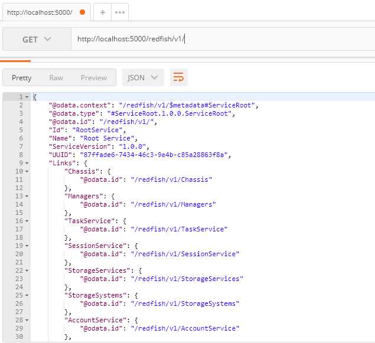
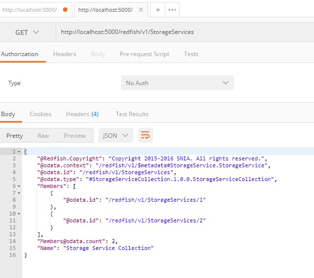
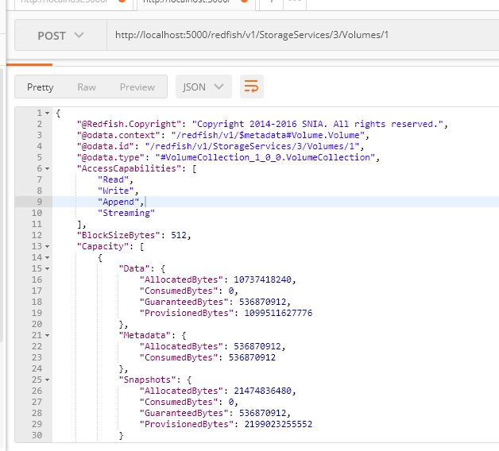
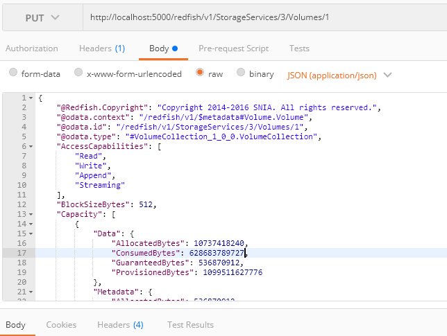
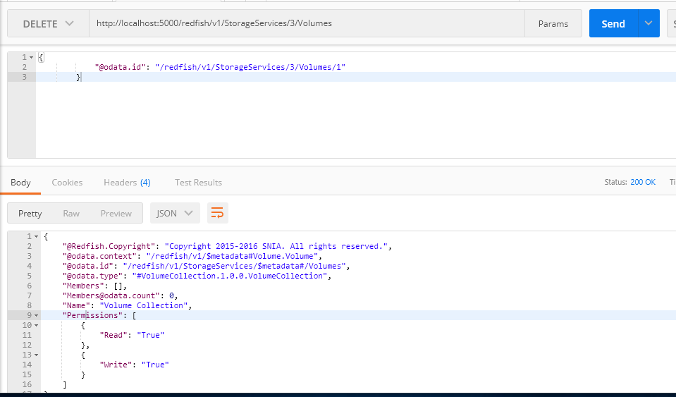

SNIA SwordfishTM API Emulator User Guide

The purpose of this User Guide is to illustrate how to use create, read, update,
and delete RESTful operations with the Swordfish API Emulator. A developer guide
is also available.

Contents
- [Disclaimer](#disclaimer)
- [Introduction](#introduction)
- [Using the Swordfish API Emulator](#using-the-swordfish-api-emulator)
  * [REST Operations:](#rest-operations)
  * [API functionality demonstrated using Postman:](#api-functionality-demonstrated-using-postman)

Disclaimer
==========

The information contained in this publication is subject to change without
notice. The SNIA makes no warranty of any kind with regard to this
specification, including, but not limited to, the implied warranties of
merchantability and fitness for a particular purpose. The SNIA shall not be
liable for errors contained herein or for incidental or consequential damages in
connection with the furnishing, performance, or use.

Suggestions for revisions should be directed to <http://www.snia.org/feedback/>.

Copyright © 2016-2019 Storage Networking Industry Association.

Introduction
============

**SNIA Swordfish™ Specification**

The SNIA Swordfish™ specification helps to provide a unified approach for the
management of storage and servers in hyperscale and cloud infrastructure
environments, making it easier for IT administrators to integrate scalable
solutions into their data centers. SNIA Swordfish is an extension of the DMTF
Redfish specification, and the same easy-to-use RESTful interface is used, along
with JavaScript Object Notation (JSON) and Open Data Protocol (OData), to
seamlessly manage storage equipment and storage services in addition to servers.

SNIA Swordfish is designed to integrate with the technologies used in cloud data
center environments and can be used to accomplish a broad range of storage
management tasks, from the simple to the advanced.

SNIA Swordfish has been designed around management use cases that focus on what
IT administrators need to do with storage equipment and storage services in a
data center. As a result, the API provides functionality that simplifies the way
storage can be allocated, monitored, and managed.

**SNIA Swordfish Scalable Storage Management API Emulator**

The Swordfish API Emulator can emulate a Swordfish-based system that responds to
create, read, update, and delete RESTful API operations to allow developers to
model new Swordfish functionality, test clients, demonstrate Swordfish, and do
other similar functions.

The Swordfish API Emulator extends the [DMTF Redfish Interface
Emulator](https://github.com/DMTF/Redfish-Interface-Emulator), adding code that
supports dynamic interactions with all of the Swordfish schema.

Installation instructions are documented in the Swordfish Emulator README file.
(Note: This document includes pointers to the Redfish Interface Emulator, found
at <https://github.com/DMTF/Redfish-Interface-Emulator>.)

The Redfish Interface Emulator contains static and dynamic resources. Static
resources are read-only instances created from Redfish mockups in the
api_emulator/redfish/static directory. Dynamic Resources are modifiable
instances whose behavior is defined by Python API and template files. The API
files define the resource behavior for individual RESTful operations, and the
template files are used to create initial versions of resources.

The Swordfish API Emulator resources are all dynamic, so the Python API and
template files are included for both singleton (single instance) and collection
resources. Once the resource instances are created for Swordfish, they are
stored as files in the Resources directory. Create, Read, Update and Delete
operations can be done on these dynamic resources using RESTful operations.

The Swordfish API Emulator code is maintained on GitHub by the SNIA, and the
Redfish Interface Emulator code is maintained on GitHub by the DMTF.

Using the Swordfish API Emulator
================================

REST Operations:
----------------

Swordfish supports RESTful commands (GET, POST, PUT and DELETE). These
operations are performed using a REST interface. In this document we demonstrate
the interactions using Postman, (<https://www.getpostman.com>). Postman is a
tool for performing integration testing with an API. It allows for repeatable,
reliable tests that can be automated and used in a variety of environments and
includes useful tools for persisting data and simulating how a user might
interact with the system. Postman is available as a standalone app or as a
browser plugin. Other similar REST tools can be used as well.

API functionality demonstrated using Postman:
---------------------------------------------

Postman is used for all REST operations shown here. Each example shown describes
a REST operation followed by a figure showing the basic operation, as well as an
example result and payload. A Postman account might be needed for testing and
can be created at <https://identity.getpostman.com/signup>.

Commands and screenshots for commands GET, POST, PUT, and DELETE are included
below. A brief description, command syntax and a screenshot each is listed
below.

1.  **GET** Operation

The GET operation is used to retrieve resources.

The GET operation shown below retrieves the top-level resources in the Redfish
service root.

**Command**: **GET** http://localhost:5000/redfish/v1/

The GET operation shown below retrieves the resources in the storage services
collection. The members of the collection and the number of members
(members\@odata.count) are displayed.

**Command**: **GET** http://localhost:5000/redfish/v1/StorageServices

1.  **POST** Operation

The POST operation is used to create a new resource in a collection. When used
with the emulator, it will create a new instance of a resource, along with new
instances of any subresources associated with the new resource.

The POST operation shown below creates a new “3” resource in the StorageServices
collection.

**Command**: **POST** <http://localhost:5000/redfish/v1/StorageServices/3>

The POST operation shown below creates a new “1” resource in the
“StorageServices/3/Volumes” collection.

**Command**: **POST**
http://localhost:5000/redfish/v1/StorageServices/3/Volumes/1

1.  **PUT** Operation

    The PUT operation is used to completely replace an existing instance of a
    resource in a collection.

    The PUT operation shown below replaces the “1” resource in the
    StorageServices/3/Volumes collection. Note that the user must pass a
    complete JSON file in the body of the command, and that JSON
    (application/json) must be declared before sending the command.

    **Command**: **PUT**
    http://localhost:5000/redfish/v1/StorageServices/3/Volumes/1

1.  **Delete** a resource

    The DELETE operation is used to remove a resource from a collection.

    The DELETE operation shown below removes the “1” resource from the
    StorageServices/3/Volumes collection.

    **Command**: **DELETE**
    http://localhost:5000/redfish/v1/StorageServices/3/Volumes/1

Additional information about the SNIA Swordfish specification and usage is
available at https://www.snia.org/forums/smi/swordfish and
<https://github.com/SNIA>.
